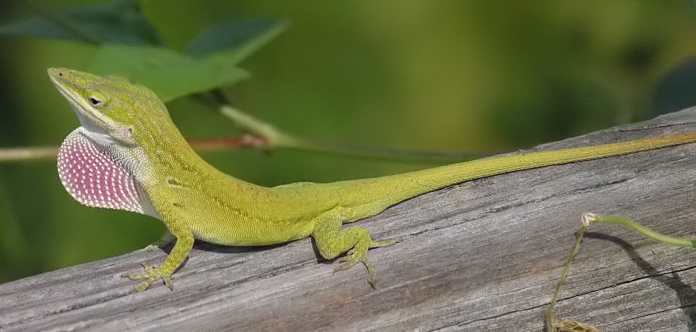

<html>
<header>
   
   <h1 id="logo">The Fascinating Water lizard</h1>
</header>
<body>

The common basilisk (Basiliscus basiliscus) is a species of lizard in the <a href="https://en.wikipedia.org/wiki/Family_(biology)">family</a> <a href="https://en.wikipedia.org/wiki/Corytophanidae">Corytophanidae</a>.
The species is <a href="https://en.wikipedia.org/wiki/Endemism">endemic</a> to Central America and South America, where it is found near rivers and streams in rainforests.
<strong>It is also known as the Jesus Christ lizard, Jesus lizard, South American Jesus lizard, or <i lang="spa">lagarto de Jesus Cristo</i> for its ability to run on the surface of water</strong>.

The common basilisk, along with the other members of its genus, take the nickname the "<a href="https://en.wikipedia.org/wiki/Jesus">Jesus Christ</a> or "Jesus lizard" because when fleeing from predators, 
they gather sufficient momentum to run across the water for a brief distance while holding most of their body out of the water (similar to the <a href="https://en.wikipedia.org/wiki/Jesus_walking_on_water">biblical story of Jesus walking on water</a>).
Basilisks have large hind feet with scaly fringes on the sides of the third, fourth, and fifth toes.
These are compressed against the toes when this lizard walks on land; but if it senses danger, it can jump into the water, opening up these fringes against the water's surface.
This increases the surface area of the foot, thus allowing it to run on the water for short distances. This occurs in three steps.
First is the slap, the downward movement of the foot that pushes water out and away from the leg. This also created pockets of air around the foot.
Next is the stroke, the backwards movement of the foot, which propels it forward. Next is the recovery, when the foot comes up and out of the water and prepares to do the slap again.
Smaller basilisks can run about 10–20 <abbr aria-label="meters">m</abbr> without sinking.Juveniles can usually run farther than older basilisks, while holding more of their body above the surface.

</body>
<footer>
<ol>
   <li>
      <a id="nav-jump" href="Description.html">Description</a>
   </li>
   <li>
      <a id="nav-jump" href="Geographic range and habitat.html">Geographic range and habitat</a>
   </li>
   <li>
      <a id="nav-jump" href="Diet.html">Diet</a>
   </li>
   <li>
      <a id="nav-jump" href="Predators.html">Predators</a>
   </li>
   <li>
      <a id="nav-jump" href="Reproduction.html">Reproduction</a>
   </li>
   <li>
      <a id="nav-jump" href="Walking on water.html">Walking on water</a>
   </li>
   <li>
      <a id="nav-jump" href="Taxonomy and etymology.html">Taxonomy and etymology</a>
   </li>
   <li>
      <a id="nav-jump" href="References and acknowledgement.html">References and acknowledgement</a>
   </li>
   <li>
      <a id="nav-jump" href="Acknowledgement.html">Acknowledgemnt</a>
   </li> 
</ol>
</footer>
</html>
